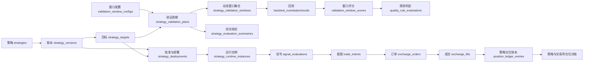
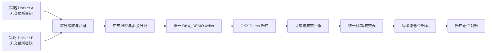

# Freqtrade AI 策略平台 V1 设计稿

- 文档状态：`V1.3 已确认 / 当前实施基线`
- 版本：`v1.3`
- 日期：`2026-08-13`
- 适用范围：策略目录、动态验证窗口与评分、交易数据目录、OKX_DEMO 运行观测、参数与 AI 优化
- 运行基线：当前系统使用 `OKX_DEMO`；本文只描述本次策略平台改版需要的数据、接口和页面
- 变更原则：优先复用现有表和执行链；新增结构只做 additive migration；历史记录不覆盖、不回写、不伪造
- 迁移规则：V1.3 全部阶段采用可验证的前向演进、兼容性和审计；不要求 down migration、反向迁移或恢复旧模型。该规则不授权删除或覆盖既有数据、静默改变历史语义或降低安全边界

## 1. 定版结论

本设计固定以下产品与架构决策，后续实现默认按此执行：

1. **策略身份是算法本身**。`pair/timeframe` 是策略版本的运行目标，不是新的策略，也不因研究批次重复创建策略身份。
2. **批次只保留来源与审计意义**。页面默认不按批次分组；批次仅作为高级筛选和证据字段。
3. **五个正式一级页面**：`策略工厂`、`交易数据`、`配置中心`、`运行情况`、`优化中心`。验证窗口是配置中心的独立子页面；总览、研究队列、生成批次、回测批次、回测任务和排行榜不再占正式一级导航。
4. **一次验证的原子单位**：`strategy_version × strategy_target × validation_window × attempt`。
5. **每次重跑都新增记录**。回测指标、评分、质量规则和配置快照不可覆盖历史结果。
6. **窗口分数和综合结论分开**。每个窗口有独立指标、评分与失败原因；active 配置中所有必需窗口完成后再形成目标级 `QUALIFIED/REJECTED/FAILED` 结论，窗口数量不设上限也不写死。
7. **质量门配置版本化**。阈值不再硬编码为页面或执行代码中的散落常量；每次验证固定引用不可变的门槛版本和 digest。
8. **验证窗口独立配置并版本化**。每个 pair/timeframe 的窗口名称、用途、开始时间、结束时间、预期市场状态和判定方法都可在专门页面查看；修改只创建新版本，不改写历史回测。
9. **候选验证使用短生命周期执行环境**。队列逐条领取任务，每次运行可启动临时容器，完成后退出；候选不长期占用容器。
10. **通过审批的 Demo 策略按运行实例隔离**。一个已部署的 `strategy_version × target` 对应一个长期运行实例，目标实现为一个策略实例一个 Docker。
11. **Docker 只隔离进程，不隔离账户仓位**。策略实例只产出信号；唯一中央风控与订单 writer 负责 OKX_DEMO 写入。
12. **订单使用统一表，不为每个策略建表**。订单与成交通过 `trade_intent`、`deployment`、`runtime_instance` 追溯到策略和版本。
13. **策略仓位使用内部追加式账本**。交易所仓位仍是账户/品种/方向汇总；两者必须持续对账。
14. **Hyperopt 与 AI 优化分开**。Hyperopt 优化参数，AI 优化代码或结构；二者都生成新策略版本，都必须重新完成当前 active 验证窗口集合。
15. **外部模型通过 API 入库**。Codex 或其他模型不能直连数据库；提交和服务端生成共用同一持久化、去重和排队服务。
16. **严格按数据库 → API → 前端三个任务执行**。先迁移全部现有真实策略和关联数据并完成数据库验收，再实现接口，最后实现页面；前一任务未通过不得开始下一任务。

### 1.1 受控数据库切换决定（2026-08-13）

经用户明确确认，V1.3 不在旧共享库 `freqtrade_ai` 上原位升级，也不再以旧
runtime/schema 兼容为交付条件：

- `freqtrade_ai` 在受控停旧完成后永久降级为只读历史迁移源；在该切换真正生效前，
  仍存续的写能力必须标记为 `CUTOVER_PENDING`。无论切换是否完成，V1.3 工具均不得
  对其执行 DDL、DML、ACL 或 schema marker 写入。
- 物理隔离的 `freqtrade_ai_design_lab` 是本阶段唯一 V1.3 owner DB；它必须从旧库
  的一致性快照导入全部需要保留的真实历史，再完成 v47 schema、双次幂等迁移、
  reconciliation、最小 ACL 和备份验收。
- owner DB 不继承旧凭据材料。一致性 dump 在导出层排除
  `okx_demo_attestation_secrets` 与 `okx_demo_operator_consent_secrets` 的 TABLE DATA，
  不读取其行内容；旧源保持不变，新库保留空 schema 并以 count=0 验收。旧 attestation
  与 runtime 记录只作历史审计，不作为新系统 capability，runtime ACL 必须撤销旧
  OKX capability 表、sequence 与 SECURITY DEFINER 函数的访问。
- 旧服务在确认 launchd label、PID、持久化控制状态和唯一 writer 所有权后，通过
  maintenance generation fence 受控停止；旧 supervisor 不得自行恢复它们。
- 新系统只允许指向 V1.3 owner DB。credential/IP/OKX attestation 仍为
  `OUT_OF_SCOPE/UNKNOWN`，因此 execution 必须 fail-closed；这不阻止纯数据层验收。
- 该决定不授权删除、覆盖或伪造旧历史，不授权读取凭据、访问 `OKX_LIVE`、创建
  信号/订单或放宽 `OKX_DEMO-only / allow_real_funds=false / unique writer`。

以下“当前基线”描述旧库的迁移源事实，不再表示 V1.3 的运行目标或兼容承诺。

## 2. 当前基线与复用边界

设计时只读确认的当前基线：

- PostgreSQL readiness 正常，schema version 为 `20260811_45`。
- 已有 `strategies`、`strategy_versions`，但目录状态、静态校验状态、质量验证状态、审批状态、部署状态仍需在读模型中分开。
- 已有 `backtest_runs`、`backtest_tasks`、`backtest_results`，可继续作为 Freqtrade 回测执行与原始结果链。
- 已有 `strategy_validation_plans`、`strategy_validation_windows`，可作为完整验证周期和窗口绑定，不再新建含义重复的主表。
- 已有 `strategy_scores`，继续保留为旧的 canonical/主评分记录；窗口评分和验证集合综合评分使用新的专用结构。
- 已有 `strategy_deployments`、`signal_evaluations`、`trade_intents`、`exchange_orders`、`exchange_fills`、`exchange_positions` 和 `reconciliation_runs`。
- `trade_intents` 已包含 `strategy_id` 与 `strategy_version_id`；订单和成交可沿外键回溯策略。
- 当前 `GET /api/hyperopt-runs` 返回空列表，尚无真实持久化的 Hyperopt 运行表。
- 当前行情 catalog 主要是文件系统即时扫描，缺少面向交易数据页面的完整、可排序持久索引。

本设计不删除或重命名上述表。存在语义冲突时，先新增字段、表或只读投影，并保留兼容窗口。

### 2.1 当前业务硬编码盘点与迁移目标

只读检查确认当前程序存在以下会阻碍扩展的业务常量。V1 实现必须迁移到版本化配置，代码只按配置执行：

| 当前硬编码类别 | 当前示例 | 迁移目标 |
| --- | --- | --- |
| 研究目标 | BTC/ETH/SOL、5m/15m | `research_target_configs` |
| 窗口集合 | 固定名称、固定时间、SOL override、固定 required 列表 | `validation_window_config_sets/configs` |
| 市场状态判定 | bull/range/bear、`+5%/-5%` | classifier registry + config parameters + regime 字典 |
| 研究规模 | 每目标 10 个、总计 60 个候选 | `generation_profile_versions` |
| 策略家族 | 固定 6 个 family | `strategy_family_definitions/strategy_family_definition_versions` 与 generation profile 关联 |
| 质量门 | 最低分 50、每窗口 30 笔、回撤 15%、收益必须为正、费用和滑点 | `quality_gate_profile_versions/rules` |
| 评分 | 主评分窗口名称、各指标权重和算法版本 | `scoring_profile_versions/rules` |
| 旧评分服务 | component/quality weights、归一化区间、淘汰条件 | scoring profile + metric definitions |
| 多样性 | signal similarity 0.90、PnL correlation 0.85 | `diversity_profile_versions/rules` |
| 执行资源 | 串行、矩阵最多 8 项、lease/timeout/retry | `worker_execution_profile_versions` |
| 调度策略 | 定时频率、是否 catch-up、领取顺序、重新验证间隔 | `scheduler_profile_versions` |
| 行情更新策略 | downloader、周期支持、重叠下载、缺口修复、新鲜度 | `market_data_policy_versions` + adapter capability |
| Demo 选择 | 固定策略白名单、最低分、pair→instrument、active slot 1–9 | deployment/target/capacity profile versions |
| Demo 风控 | stake、杠杆、最大持仓、损失和偏差门槛 | `risk_profile_versions`，由 deployment profile 引用 |
| 晋级与审批 | 正收益、20% 回撤、30 笔、3 种市场状态、批准人数 | `promotion_profile_versions` + approval policy |
| 证据时效 | 行情 20 分钟、receipt 2 小时、terminal 10 分钟、reconciliation/heartbeat TTL | `evidence_freshness_profile_versions` |
| 观测与 soak | soak 7 天、probe 间隔/最大缺口、读取缓存 TTL | `monitoring_profile_versions` + adapter capability |
| 模型生成 | provider/model、一次生成数量、模板组合 | provider/model config versions + generation profile version |
| 策略/任务来源 | AI、import、manual、scheduled 等固定 Literal 与中文映射 | versioned source definitions + trigger registry |
| 周期协议 | `5m/15m` 条件分支、信号间隔和交易所周期映射 | timeframe definition + downloader/runtime adapter capability |
| Hyperopt | spaces、loss、epochs 上限、stake/max-open-trades 默认值 | adapter capability registry + optimization profiles |
| 页面展示 | 固定窗口列、固定中文翻译、固定状态文案和默认排序 | `ui_presentation_profile_versions` + API display metadata，前端按 capability 渲染 |

当前实现的主要回收入口如下；实施时必须逐项替换，不能只新增配置表而保留旧常量继续生效：

| 当前代码入口 | 需移出的业务值 | 新读取来源 |
| --- | --- | --- |
| `backend/app/core/strategy_research_matrix.py`、`backend/app/models/strategy_research.py`、`backend/app/services/strategy_candidate_validation_queue.py`、`backend/app/services/bihourly_strategy_research.py` | BTC/ETH/SOL、5m/15m 及 pair CHECK/allowlist | active research target config |
| `backend/app/core/strategy_research_contract.py` | required window key、50 分、30 笔、15% 回撤、正收益、fee/slippage | window + quality gate + scoring profile snapshots |
| `backend/app/core/strategy_research_diversity.py` | 每目标 10 个、总数、6 个 family、0.90/0.85 | generation + family + diversity profiles |
| `backend/app/api/strategy_research.py`、`backend/app/schemas/strategy_research.py`、`scripts/formal_strategy_research_worker.py` | `requested_count=60` | generation profile；请求只能选择已激活 profile，不能覆盖策略性上限 |
| `scripts/run_strategy_candidate_research.py`、`backend/app/services/strategy_validation_matrix.py` | 窗口矩阵、SOL override、bull/range/bear 阈值和算法名 | window config + classifier adapter |
| `backend/app/schemas/deepseek_backtest_loop.py`、`backend/app/services/strategy_validation_matrix.py` | `OOS/WALK_FORWARD` 和 bull/bear/range Literal/required set | window purpose + market regime definitions |
| `backend/app/services/backtest_matrix.py` | `MAX_MATRIX_TASKS=8` | worker execution profile |
| `backend/app/services/okx_demo_strategy_selection.py`、`backend/app/services/strategy_deployment_continuation.py`、`backend/app/repositories/strategy_deployments.py`、`backend/app/models/strategy_deployment.py`、`backend/app/schemas/okx_demo_runtime_activity.py` | pair→instrument、策略选择、最低分、slot 范围及其 CHECK/schema 上限 | execution target + deployment/capacity profile |
| `backend/app/schemas/hyperopt_profile.py` | spaces/loss、epochs 上限、stake/max-open-trades 默认值 | optimizer capability + optimization profile |
| `backend/app/services/strategy_scoring.py`、`backend/app/services/strategy_promotion.py`、`backend/app/services/live_candidate_preflight.py` | 评分权重、晋级门槛、review 风控门槛 | scoring + promotion + risk profiles |
| `backend/app/services/bihourly_strategy_research.py`、`backend/app/services/qualified_demo_deployment_queue.py`、`backend/app/services/market_data_quality.py` | 行情/receipt/terminal 新鲜度、历史起点、lease | evidence freshness + target + worker profiles |
| `backend/app/services/formal_strategy_research.py`、`backend/app/adapters/okx_demo/read_adapter.py` | `5m/15m` 分支、signal timeframe 映射和 expected interval | timeframe definitions + adapter capability |
| `backend/app/schemas/strategy.py`、trigger/request DTO 与前端来源筛选 | strategy source/trigger source Literal 和中文映射 | source definition versions + display metadata |
| `backend/app/services/okx_demo_soak.py`、`backend/app/adapters/okx_demo/read_adapter.py`、runtime readiness/reconciliation 服务 | soak 周期、probe 缺口、读缓存和证据 TTL | monitoring + evidence freshness profiles；adapter 提供硬能力上限 |
| `frontend/src/pages/strategyFactoryModel.ts`、`frontend/src/pages/ResearchQueue.tsx` 及旧正式页 | 状态中文、筛选项、固定 target/window 展示 | catalog/display metadata；旧页只保留兼容深链 |

旧 migration、历史 receipt 和测试快照中可以保留当时的值作为审计证据，但运行时模块、当前 ORM 约束、API schema 和前端不得继续从这些历史值推导 active 规则。对现有 pair CHECK、slot 上限 CHECK 等限制，使用新的 additive migration 替换为引用配置/容量的约束与服务校验，不改写旧 migration 文件。

### 2.2 什么进入配置，什么保留为程序约束

“不硬编码业务规则”不等于把所有代码和安全约束改成数据库字符串：

- **必须配置化**：会因品种、周期、研究方法、资源规模、模型、评分方法或运营决策而变化的值；
- **保留在代码/数据库约束**：主外键完整性、幂等、事务、权限、凭据隔离、状态机合法迁移、digest 格式和审计不可变性；
- **安全上限与业务选择分层**：adapter/代码可以定义不可突破的安全上限与协议能力，active 配置只能在能力范围内选择或收紧；例如 Demo-only、禁止真实资金、one canonical writer 不能通过配置关闭，而候选数、并发、超时、仓位和质量门可以配置；
- **运维配置不等于产品配置**：数据库 URL、凭据引用解析、文件根目录和进程启动参数继续由受控部署环境提供；配置中心只显示脱敏 capability 和引用名，不读取或保存 secret；
- **状态 key 保持协议稳定**：状态机 key 和合法迁移由代码/数据库契约维护，不能由页面随意新增；中文名称、颜色、帮助文案和筛选顺序来自 display metadata；
- **算法使用注册表**：分类器、评分器、数据下载器、回测器、模型 provider 和优化器的实现仍是经过测试的代码插件；数据库只保存 `adapter_key/version/parameters`，不能从数据库加载任意 Python 代码执行；
- **能力与选择分离**：代码注册“系统实现了什么”，数据库配置“当前启用什么”；配置引用不存在或不兼容的 adapter 时拒绝激活；
- **配置全部版本化**：active 配置不可原地修改；新建草稿、校验、激活，历史执行永远引用原版本和 digest；
- **无默认回退**：数据库配置缺失、版本不兼容或解析失败时返回 `BLOCKED/UNKNOWN`，不得静默使用代码中的隐藏默认值。

### 2.3 扩展分级与禁止模式

扩展按影响面分为三类：

1. **纯配置扩展**：新增或调整品种、周期、窗口、市场状态、阈值、评分规则、生成数量、策略家族、调度、并发、容量、风控、行情更新和页面显示，只增加配置版本，不改 schema 和主流程代码；
2. **adapter 扩展**：新增分类算法、评分算法、数据源、模型 provider、回测器、runtime 或 optimizer，实现统一 adapter 协议并注册 capability，不修改已有 adapter；
3. **领域扩展**：只有出现新的持久化实体或不可由现有 schema 表达的关系时，才做 additive migration，并保留旧契约兼容窗口。

实现中禁止出现以下模式：按 `pair/timeframe/window_key/provider/model/optimizer` 写业务分支；用数组下标代表某个窗口；在 DTO、前端列或测试中假定窗口数量；把阈值、候选数、并发数、容量或中文文案写成模块常量；配置缺失后静默采用 fallback。状态机、鉴权、幂等和事务等安全不变量不属于业务配置，仍由代码与数据库约束强制执行。

## 3. 领域关系



### 3.1 状态必须分维度表达

单个 `status` 不得同时表示“策略是否存在、是否通过回测、是否批准、是否部署”。正式读模型固定输出：

| 维度 | 示例状态 | 唯一含义 |
| --- | --- | --- |
| `catalog_status` | `DRAFT/ACTIVE/ARCHIVED` | 策略目录状态 |
| `static_validation_status` | `PENDING/PASSED/FAILED` | 代码、schema、lookahead 等静态校验 |
| `research_status` | `NOT_QUEUED/QUEUED/RUNNING/QUALIFIED/REJECTED/FAILED` | 当前验证窗口集合的研究质量结果 |
| `approval_status` | `NOT_REQUESTED/PENDING/APPROVED/REJECTED` | 人工或治理批准 |
| `deployment_status` | `NOT_DEPLOYED/ACTIVE/DISABLED` | OKX_DEMO 部署 |
| `runtime_status` | `UNKNOWN/STARTING/HEALTHY/DEGRADED/STOPPED/FAILED` | 运行实例健康 |

读取不到权威来源时返回 `UNKNOWN`，不得转换为 0、空仓、无订单或正常。

## 4. 数据库设计

### 4.1 直接复用的现有表

| 表 | V1 用途 | 处理方式 |
| --- | --- | --- |
| `strategies` | 策略身份、名称、描述、来源、标签 | 保留；列表读模型组合其他状态，不扩张 `status` 含义 |
| `strategy_versions` | 不可变代码、蓝图、参数和父版本 | 保留；静态验证与动态窗口质量验证分离 |
| `backtest_runs/tasks/results` | 回测执行、目标任务、原始指标 | 保留；每个窗口绑定独立的 run/task/result |
| `strategy_validation_plans/windows` | 一次完整验证与其配置的任意数量窗口 | 保留并 additive 扩展 |
| `strategy_scores` | 旧 canonical/primary score | 保留兼容，不承担窗口评分 |
| `strategy_deployments/signal_evaluations` | Demo 部署和闭合 K 线信号 | 保留 |
| `trade_intents/exchange_orders/exchange_fills` | 意图、订单、成交的权威链 | 保留并补运行实例关联 |
| `exchange_positions/reconciliation_runs` | 交易所账户仓位与账户级对账 | 保留，不冒充策略仓位 |

### 4.2 新增与扩展结构

#### 通用配置骨架

所有可变配置共用生命周期和激活模型，避免每新增一类配置就复制一套表和 API：

- `configuration_types`：`type_key/name_zh/description_zh/schema_version/handler_key/editor_capability/enabled`；
- `configuration_versions`：`id/type_key/version_number/lifecycle_status/payload_json/schema_version/config_digest/change_summary/created_by/created_at/validated_at`；`lifecycle_status` 只取 `DRAFT/VALIDATED/RETIRED`，不表达某个 scope 是否 active；
- `configuration_dependencies`：`configuration_version_id/depends_on_version_id/relation_key`，保存总装配和子配置的精确版本依赖；
- `configuration_activations`：`config_type/scope_type/scope_key/version_id/activated_at/activated_by`，同一 scope 同类配置只能有一个 active binding；
- `configuration_audit_events`：草稿创建、校验、激活、停用和失败的操作者、时间、request id 与原因。

简单配置可以完整保存在经过 JSON Schema 校验的 `payload_json`；需要外键、唯一约束、范围查询或高频联表的窗口、规则、目标等配置使用下述专表，专表主键同时 FK → `configuration_versions.id`。通用层负责版本、digest、scope 和审计，专表负责领域完整性；不得出现通用表和专表各自维护一套 active 状态。

#### 配置装配与任务快照

不建立一个包办全部场景的“全局配置”。按工作流定义独立总装配 profile：

- research profile：target、window、quality、scoring、generation、diversity、provider、market data、freshness、scheduler、worker；
- market-data profile：target、downloader、market data policy、freshness、worker；
- optimization profile：optimizer、target、window、scoring、quality、market data、worker；
- deployment profile：execution target、promotion、risk、capacity、runtime、monitoring、freshness；
- UI presentation profile：页面 capability、列、筛选、排序和 display metadata。

创建具体任务时，application service 在一个事务内按 `scope + aggregate_profile_version_id` 解析全部依赖，校验状态、schema、adapter capability 和循环依赖，然后写入 `configuration_bundle_snapshots`：

- `id/workflow_kind/scope_type/scope_key/aggregate_profile_version_id`；
- `resolved_versions_json/resolved_digests_json/bundle_digest`；
- `capability_snapshot/created_at`。

`research_jobs`、validation plan、market data update job、optimization run、deployment 和 runtime instance 分别新增 nullable `configuration_bundle_snapshot_id`。历史记录仅在存在可重算的版本证据时回填；缺失证据或受既有不可变审计 trigger 保护的历史记录必须保留 `NULL/UNKNOWN`，并在 append-only migration mapping 中明确记录，禁止用迁移时合成的 generic profile 冒充当时配置。所有 V1.3 新记录通过数据库 trigger 强制必填。worker 只从该 bundle 读取配置；任务创建后即使 active 版本变化，也不能改变已排队、运行中或已完成任务。配置版本升级需要创建新版本；旧 adapter 暂时不可用时历史数据仍可读，但重跑必须明确 `BLOCKED_ADAPTER_UNAVAILABLE`，不能自动替换实现。

#### `strategy_targets`

一个策略版本可面向多个运行目标。

| 字段 | 说明 |
| --- | --- |
| `id` | 主键 |
| `strategy_version_id` | FK → `strategy_versions.id` |
| `execution_target_id` | FK → `execution_target_definitions.id`；当前 active 定义为 `OKX_DEMO`，研究可引用非交易 scope |
| `instrument_id` | 例如 `BTC-USDT-SWAP` |
| `pair` | Freqtrade pair，例如 `BTC/USDT:USDT` |
| `timeframe` | 例如 `5m`、`15m` |
| `status` | `ENABLED/DISABLED` |
| `validation_priority` | 从 target/scheduler 配置快照取得的调度优先级；创建时必须显式写入 |
| `last_completed_validation_at` | 最近完整验证结束时间；未验证为空 |
| `next_validation_not_before` | 可选的最早再次验证时间 |
| `created_at/updated_at` | 时间 |

唯一约束：`(strategy_version_id, execution_target_id, instrument_id, timeframe)`。目标类型、交易所和运行方式均从定义表读取，不能用代码枚举把新 target 限制为 `OKX_DEMO`。

#### `validation_window_config_sets`

一组可以整体校验和激活的窗口配置版本：

| 字段 | 说明 |
| --- | --- |
| `id` | 主键 |
| `name` | 例如“正式动态验证窗口配置” |
| `version_number` | 递增版本号 |
| `lifecycle_status` | 继承通用版本的 `DRAFT/VALIDATED/RETIRED`；不另建窗口专用状态 |
| `default_classifier_adapter_key` | 当前为 `window-close-return-v1`，具体窗口可选择其他已注册 classifier |
| `default_classifier_parameters` | 当前为牛市 `>= +5%`、熊市 `<= -5%`、其余震荡 |
| `config_digest` | 整组配置的稳定 digest |
| `change_summary` | 为什么调整窗口 |
| `created_at/activated_at` | 时间 |

同一 `scope_type + scope_key` 同一时刻只允许一个 activation 指向该类型的 `VALIDATED` 配置版本。版本一经 `VALIDATED` 就不可编辑；调整窗口必须复制为新的 `DRAFT` 版本，校验通过后再原子切换 activation。V1 正式研究使用一个明确的 production-research scope，design lab 使用独立 scope，不能依赖“全局默认配置”。

#### `validation_window_configs`

每一行表示某个品种、周期和窗口的配置：

| 字段 | 说明 |
| --- | --- |
| `config_set_id` | FK → `validation_window_config_sets.id` |
| `pair/timeframe/data_kind` | 例如 `BTC/USDT:USDT`、`5m`、`futures` |
| `window_key` | 配置版本内唯一的稳定 slug；当前数据可为 `primary_bear/wf_bull/...`，未来可新增任意 key |
| `purpose_key` | 与 `config_set_id` 组成 FK → 同版本 `validation_window_purposes`；当前迁移值有主评分、准入验证、独立样本外等用途 |
| `ordinal` | 页面和执行顺序 |
| `name_zh` | 中文窗口名称 |
| `description_zh` | 为什么选择这段时间、如何使用 |
| `start_at` | UTC，包含该时刻 |
| `end_at` | UTC，不包含该时刻 |
| `classifier_adapter_key/parameters` | 可覆盖 config set 默认 classifier；必须引用已注册兼容 adapter |
| `required` | 是否属于本轮必需验证窗口 |
| `source_receipt_id` | 用于验证该配置的数据 receipt |
| `classification_evidence` | 首尾收盘价、净涨跌幅、样本数、实算市场状态和数据 digest |

唯一约束：`(config_set_id, pair, timeframe, data_kind, window_key)`。数据库不得用 CHECK 或枚举限制窗口 key、窗口数量、用途数量或市场状态数量。

#### `validation_window_purposes`、`market_regime_definitions` 与 `validation_window_expectations`

窗口用途和市场状态使用配置版本内的可扩展字典表：

- `validation_window_purposes`：`config_set_id/key/name_zh/description_zh/counts_for_qualification/enabled/sort_order`；
- `market_regime_definitions`：`config_set_id/key/name_zh/description_zh/dimension_key/enabled/sort_order`；
- `validation_window_expectations`：`window_config_id/dimension_key/operator/expected_value/required`；一个窗口可以同时约束趋势、波动率、流动性等多个维度；
- 当前迁入主评分、准入验证、独立样本外，以及 bull/range/bear；
- 以后可以增加压力测试、极端波动、高/低流动性等用途或状态，不改表、不改 API schema、不增加前端条件分支。

窗口市场状态不能只靠名称声明。保存草稿或激活前必须使用对应 pair/timeframe 的真实行情重新计算：

```text
净涨跌幅 = 时间段内最后一根 K 线收盘价 / 第一根 K 线收盘价 - 1

净涨跌幅 >= +5%  → bull（牛市）
净涨跌幅 <= -5%  → bear（熊市）
-5% < 净涨跌幅 < +5% → range（震荡市）
```

`window-close-return-v1` 只使用窗口首尾收盘价，不分析窗口内部的波动路径、最大回撤、均线斜率或趋势持续时间。页面必须把这个限制写出来，不能把它包装成完整市场周期识别。未来若采用更复杂的分类算法，必须作为新的 config set 版本保存，并重新生成全部分类证据。

边界统一为 `[start_at, end_at)`。例如结束时间为 `2024-03-01 00:00 UTC`，表示最后一根 5m K 线从 `2024-02-29 23:55` 开始，最后一根 15m K 线从 `2024-02-29 23:45` 开始，两者都在 `2024-03-01 00:00` 收盘。

当前 `OOS` 表示“独立样本外验证用途”，不是一种行情状态。因此它可以没有 required expectation；页面仍展示 classifier 算出的实际状态，但不会因为它是牛市、震荡市或熊市而改变 OOS 身份。

#### 扩展 `strategy_validation_plans`

物理表继续使用现有名称，产品界面称为“完整验证”或“验证周期”。新增：

- `strategy_target_id`：FK → `strategy_targets.id`；
- `quality_gate_profile_version_id`：固定本轮门槛版本；
- `validation_window_config_set_id`：固定本轮使用的窗口配置版本；
- `cycle_number`：同一版本与目标的第几次完整验证；
- `trigger_source_key`、`trigger_metadata`：来源 key 由 trigger registry 声明；当前迁移值为 scheduled、manual、optimization、import，未来新增来源不改表；
- `status` 扩充为 `DECLARED/QUEUED/RUNNING/PASSED/QUALIFIED/REJECTED/FAILED/BLOCKED`；其中 `PASSED` 仅兼容历史计划，新 V1 完整验证使用 `QUALIFIED/REJECTED`；
- `started_at/completed_at`；
- `policy_snapshot_digest`、`market_data_snapshot_digest`。

唯一约束：`(strategy_target_id, cycle_number)`。完整验证一旦开始，策略代码、目标、窗口、数据 receipt 和门槛版本全部锁定。

#### 扩展 `strategy_validation_windows`

新增：

- `window_config_id`：FK → 本轮锁定 config set 中的具体窗口；
- `window_key_snapshot/name_zh_snapshot/description_zh_snapshot`：保留执行时的窗口显示信息；
- `attempt_number`；
- `net_profit_after_cost`、`max_drawdown`、`volatility`、`total_trades` 等常用摘要列；
- `status` 扩充为 `DECLARED/READY/RUNNING/PASSED/REJECTED/FAILED/BLOCKED`；
- `failure_code`、`failure_message`。

原始完整指标继续保存在关联 `backtest_results.metrics_snapshot`，摘要列只服务排序和筛选。

唯一约束：`(validation_plan_id, window_config_id, attempt_number)`。重跑新增 attempt，不覆盖旧窗口结果；执行器遍历 plan 关联的窗口列表，不引用固定名称列表。

#### `quality_gate_profiles` 与 `quality_gate_profile_versions`

`quality_gate_profiles` 保存可读身份；`quality_gate_profile_versions` 保存不可变版本、说明、状态、digest 和完整 snapshot。

版本生命周期：`DRAFT/VALIDATED/RETIRED`；生效 scope 只读取 `configuration_activations`。切换 activation 不改变任何历史验证结果。

#### `quality_gate_rules`

每条规则独立配置：

| 字段 | 示例 |
| --- | --- |
| `profile_version_id` | 门槛版本 |
| `pair/timeframe` | 可空；空表示通用规则 |
| `window_selector` | 可按 window config、purpose、regime、tag 或全部窗口选择，不依赖固定窗口 key |
| `metric_definition_id` | 引用版本化 metric registry；当前可为净收益、回撤、波动率、交易数，未来指标不改表 |
| `evaluation_adapter_key/parameters` | 简单比较或复合规则 adapter；支持的 operator 由 adapter capability 声明 |
| `threshold_value/threshold_max` | 阈值 |
| `unit` | `ratio/percent/count` |
| `severity` | `BLOCKING/WARNING` |
| `score_weight` | 评分权重 |
| `priority` | 配置中显式给出的规则优先级 |

规则不在程序中写死 scope 优先级。配置版本显式保存 `priority`；同一指标、同一 selector 命中多个相同最高优先级且结果冲突时，门槛版本不能激活。

首个激活版本必须由当前正式契约 `formal-strategy-research-aggressive-v1` 原样迁移，不能在迁移时顺便调整门槛：

- 策略最低评分 `50`；
- 每个验证窗口至少 `30` 笔交易；
- 每个验证窗口成本后净收益必须大于 `0`；
- 每个验证窗口最大回撤不得超过 `15%`；
- 单边手续费不低于 `0.05%`，单边滑点不低于 `0.02%`；
- 必须通过 lookahead analysis；
- 首次迁移把当前 `wf_bull/wf_range/oos/wf_bear` 标记为 `required=true`；后续必需集合完全从 active 窗口配置读取，不在质量门或程序中保存固定名称列表。

当前正式契约没有波动率阻断阈值。V1 可以支持该指标配置，但在用户确认具体数值前只能保存为未激活草稿，不能自行发明阈值。

#### `validation_window_scores`

每个窗口 attempt 一条不可变评分：

- `validation_window_id UNIQUE`；
- `scoring_version`、`profile_version_id`；
- `total_score`、`component_scores_snapshot`；
- `metrics_snapshot`、`score_digest`、`created_at`。

需要排序和解释的评分分量写入 `validation_window_score_components(validation_window_score_id, component_key, raw_value, normalized_value, weight, contribution, ordinal)`。新增收益、风险、稳定性之外的评分分量时只增加 metric/scoring 配置，不增加列。

#### `quality_rule_evaluations`

保存每条规则在某窗口的判定证据：

- `validation_window_score_id`、`quality_gate_rule_id`；
- `actual_value`、`operator`、`threshold_snapshot`；
- `passed`、`failure_code`、`explanation`。

页面“为什么被拒绝”只读取该表和对应原始指标，不从总分猜测。

#### `strategy_evaluation_summaries`

每个验证周期一条综合结论：

- `validation_plan_id UNIQUE`；
- `required_window_count/passed_window_count/failed_window_count`；
- `overall_score`；
- `status`：`QUALIFIED/REJECTED/FAILED/BLOCKED`；
- `primary_failure_window_config_id`、`reason_codes`；
- `summary_digest`、`created_at`。

`QUALIFIED` 必须由 active 配置中动态查询出的所有 `required=true` 窗口与阻断规则共同计算，不能由前端设置，也不能因名额不足降低门槛。`required_window_count` 是运行时聚合结果，绝不能写成常量。

#### `strategy_submissions`

统一接收 Codex、其他模型和人工导入：

- `id`、`idempotency_key`、`source_adapter_key`、`provider_model_config_id`；
- `request_digest`、`code_digest`、`blueprint_digest`；
- `description`、`payload_snapshot`；
- `status`：`RECEIVED/VALIDATING/ACCEPTED/DUPLICATE/REJECTED/FAILED`；
- `strategy_id/strategy_version_id/research_job_id`；
- `error_code/error_message`、时间字段。

外部调用方只调用 API，不持有数据库凭据，不提交模型 API key。

#### `strategy_runtime_instances`

一个长期 Demo 策略实例一条记录：

- `deployment_id`、`strategy_target_id`；
- `runtime_adapter_key`：FK/逻辑引用 → `adapter_definitions.adapter_key`；当前 active adapter 可为 `docker-runtime-v1`，测试工程可选择已注册的 simulated adapter；
- `runtime_instance_id`、`container_name`、`image_digest`、`config_digest`；
- `status`、`started_at/stopped_at/heartbeat_at`；
- `last_error_code/last_error_message`。

同一 deployment 只允许一个未停止的 active runtime instance；重启产生新实例记录，旧实例保留终止时间和错误证据。给 `strategy_deployments` additive 增加 nullable 的 `strategy_target_id`，再按现有版本、instrument 和 timeframe 做受控回填。

同时给 `trade_intents` additive 增加 nullable 的 `deployment_id`、`signal_evaluation_id`、`runtime_instance_row_id`。历史行保留为空并明确标记 legacy/unknown。

#### `strategy_position_ledger_entries`

策略仓位使用追加式账本，不直接修改历史成交：

- `strategy_id/strategy_version_id/deployment_id/runtime_instance_id`；
- `exchange_fill_row_id UNIQUE`：FK → `exchange_fills.id`；
- `instrument_id/position_side`；
- `quantity_delta/price/fee/realized_pnl_delta`；
- `event_type`：`OPEN/INCREASE/REDUCE/CLOSE/ADJUSTMENT`；
- `created_at`。

当前策略仓位由数据库 view 或专用只读投影汇总。`ADJUSTMENT` 必须引用人工确认的 reconciliation 证据，禁止静默改账。

#### `strategy_position_reconciliation_items`

关联现有 `reconciliation_runs`，逐个策略/品种显示虚拟仓位；同时保存该品种所有策略合计与交易所实际仓位差异。交易所无法按策略区分时，页面必须显示“内部归属”，不能伪装为交易所原生仓位。

#### `market_data_file_records`

行情数据仍保存在 Feather/Parquet 文件，不把 K 线明细导入 PostgreSQL。数据库只保存索引：

- exchange、market type、pair、instrument、timeframe、data kind；
- absolute/relative path、format、size、sha256；
- row count、first open time、last open/close time；
- gaps、duplicates、null count、freshness status；
- scan/receipt id、observed_at。

唯一键以规范化文件身份和 digest 设计；文件变化产生新的扫描事实，不篡改历史 receipt。

#### `market_data_update_jobs` 与 `market_data_update_items`

交易数据更新通过异步任务执行，前端不能直接运行下载脚本：

- job 保存 exchange、pair、触发人、请求的 timeframes、状态、开始/结束时间和错误摘要；
- item 对应一个 pair/timeframe/data kind，保存更新前后时间范围、增加行数、目标最新闭合 K 线时间和 artifact；
- 状态使用 `QUEUED/RUNNING/SUCCEEDED/PARTIAL/FAILED/BLOCKED`；
- 同一数据文件同时只允许一个更新 item，重复请求返回已有活动任务；
- 写文件采用临时文件 → 格式/时间/重复/空值校验 → 原子替换；失败时保留原文件；
- “最新”固定指任务启动时交易所已经闭合的最后一根 K 线，不写入尚未闭合的 K 线。

#### 可扩展研究配置表

除窗口和质量门外，其他可变业务规则也必须有正式配置表：

- `research_profile_versions`：一次研究的总装配配置，引用 target、window、quality gate、scoring、diversity、generation、market data、scheduler 和 worker profile version；
- `research_target_config_sets/research_target_configs`：exchange、pair、instrument、timeframe、data kind、启用状态、优先级和数据新鲜度要求；
- `generation_profile_versions`：每目标候选数量、结构槽位、模型选择策略和生成限制；
- `strategy_family_definitions/strategy_family_definition_versions`：稳定 family key，以及版本化的中文名称、说明和启用状态；generation profile 用关系表选择所需 family version；
- `scoring_profile_versions/scoring_rules`：指标、归一化算法、权重、数据来源和聚合方法；
- `metric_definition_versions`：指标 key、中文名称、单位、数据来源、可用聚合和展示格式，供评分、门槛、列表筛选复用；
- `trigger_source_definitions/trigger_source_definition_versions`：稳定来源 key，以及版本化的中文名称、审计要求和启用状态；只描述来源，不允许携带可执行代码；
- `strategy_source_definitions/strategy_source_definition_versions`：稳定策略来源 key、中文名称、是否允许外部提交和所需审计字段；
- `timeframe_definitions/timeframe_definition_versions`：稳定 timeframe key、秒数、中文名称和排序；各 adapter capability 单独保存该 key 的外部格式映射，不能在业务服务里用 `if timeframe == ...` 换算；
- `diversity_profile_versions/diversity_rules`：相似度、相关性及以后新增的多样性指标门槛；
- `worker_execution_profile_versions`：并发数、批量大小、lease、heartbeat、timeout、retry、backoff 和资源上限；
- `scheduler_profile_versions`：启用状态、cron/interval、时区、jitter、catch-up、重新验证间隔和领取排序策略；
- `market_data_policy_versions`：downloader adapter、周期 capability、增量重叠范围、缺口修复、新鲜度和更新资源限制；
- `evidence_freshness_profile_versions`：按 evidence kind 配置 max age、future skew、renewal lead 和过期后的 fail-closed reason；
- `monitoring_profile_versions`：心跳、缓存 TTL、soak 时长、probe 间隔、最大 probe gap、保留策略和告警门槛；
- `deployment_profile_versions`：execution target、允许的 target/strategy selector、容量、风险配置和 promotion 要求；
- `promotion_profile_versions`：研究结果进入审批或部署前所需的质量、市场覆盖、证据链和人工批准条件；
- `risk_profile_versions`：stake、杠杆、最大持仓、账户/品种/策略风险门槛和异常时的 fail-closed 行为；
- `execution_target_definitions/execution_target_definition_versions`：稳定 target key，以及版本化的中文名称、交易/非交易 scope、exchange adapter、runtime adapter、writer policy 和启用状态；
- `provider_model_config_versions`：provider、model、能力、超时、生成限制和启用状态，只保存凭据引用名，不保存凭据值；
- `optimization_profile_versions`：optimizer adapter、spaces、loss、epochs 上限、默认参数和资源限制；
- `ui_presentation_profile_versions`：目录默认排序、可见列、筛选器顺序、状态中文 display metadata 和页面 capability；只保存展示配置，不保存可执行代码。

所有配置版本通过通用 `configuration_activations` 绑定使用范围；唯一约束保证一个 scope 同类配置只有一个 active binding。解析配置时必须给出确切 scope，不做跨 scope 的隐式继承或全局 fallback。

`research_profile_versions` 是一次研究的唯一配置入口。创建研究任务时把它引用的所有子版本 ID 和 digest 一次性写入 snapshot；执行代码不得再读取模块级业务常量补全缺失字段。

这里的“唯一配置入口”只指研究工作流；行情更新、优化、部署和 UI 使用上一节各自的 aggregate profile，不把无关配置强行耦合到 research profile。

#### `adapter_definitions`

所有可替换实现通过 adapter registry 扩展：

- `adapter_key`、`adapter_kind`、`implementation_version`、`input_schema_version`、`capabilities`、`enabled`；
- adapter kind 包括 market classifier、scorer、quality evaluator、market data downloader、backtest runner、generation provider、optimizer 和 runtime provider；
- 程序启动时把已安装的 adapter 能力与数据库 registry 对账；
- 配置只能引用已安装、启用且 schema 兼容的 adapter；新增算法通过新增 adapter 实现，不在主流程增加 `if window == ...` 或 `if provider == ...` 分支。

#### `optimization_runs` 与 `optimization_trials`

`optimization_runs` 保存 `optimizer_adapter_key`、`optimization_profile_version_id` 和 adapter 返回的类别/display metadata，不用 `HYPEROPT/AI_STRUCTURE` 固定枚举限制后续优化器；当前注册的两个 adapter 分别提供 Hyperopt 参数优化和 AI 结构优化。`optimization_trials` 保存每次试验参数、指标、状态和 artifact。成功选择的 trial 只能创建新的 `strategy_version`，不得覆盖父版本或自动部署。

## 5. 回测调度与执行

### 5.1 选择策略

定时调度器从可验证的 `strategy_targets` 中选择目标，不直接把 `strategies` 表当队列：

```sql
ORDER BY
  validation_priority DESC,
  last_completed_validation_at NULLS FIRST,
  created_at ASC,
  id ASC
```

规则：

- 从未完成完整验证的目标优先；
- 其次选择距离上次完整验证最久的目标；
- 相同条件按最早创建顺序；
- 调度器只创建 durable `research_job` 和 validation plan，不在 HTTP 请求内跑回测；
- 通过唯一 job key 防止同一版本、目标、窗口配置版本、门槛版本和数据快照重复入队；
- worker 继续使用 lease、heartbeat、expiry 和数据库锁，当前实现保持全局串行；
- 候选生成、候选持久化和验证执行仍然分离。

### 5.2 动态验证窗口执行

当前待迁移的正式配置示例包含一个主评分窗口和若干准入验证窗口。这里列出的是初始数据，不是程序固定结构：

| 代码 | 中文名称 | 用途 | 预期状态 |
| --- | --- | --- | --- |
| `primary_bear` | 主评分熊市窗口 | 计算当前正式策略主评分，不计入必需验证窗口通过数量 | 熊市 |
| `wf_bull` | 牛市验证窗口 | 验证上涨行情中的适应性 | 牛市 |
| `wf_range` | 震荡市验证窗口 | 验证方向不明显行情中的稳定性 | 震荡市 |
| `oos` | 独立样本外窗口 | 使用未参与主评分和 walk-forward 选择的数据做独立验证 | 不预设 |
| `wf_bear` | 熊市验证窗口 | 验证下跌行情中的风险与适应性 | 熊市 |

当前 BTC 配置中，5m 与 15m 使用相同的 UTC 日历边界，但 K 线数量和首根开盘时间粒度不同：

| 窗口 | 时间范围 `[开始, 结束)` | 日历长度 | BTC 5m 实算 | BTC 15m 实算 | 为什么这样命名 |
| --- | --- | ---: | --- | --- | --- |
| 主评分熊市 | `2023-07-01 00:00` 至 `2023-10-01 00:00` | 92 天 | 26,496 根，净涨跌 `-11.58%` | 8,832 根，净涨跌 `-11.46%` | 两个周期都不高于 `-5%`，判定为熊市 |
| 牛市验证 | `2023-10-01 00:00` 至 `2024-03-01 00:00` | 152 天 | 43,776 根，净涨跌 `+126.82%` | 14,592 根，净涨跌 `+126.76%` | 两个周期都不低于 `+5%`，判定为牛市 |
| 震荡市验证 | `2024-03-01 00:00` 至 `2024-06-29 00:00` | 120 天 | 34,560 根，净涨跌 `-1.20%` | 11,520 根，净涨跌 `-1.36%` | 两个周期都位于 `-5%` 与 `+5%` 之间，判定为震荡市 |
| 独立样本外 | `2025-01-01 00:00` 至 `2025-10-01 00:00` | 273 天 | 78,624 根，实算 `+21.70%` | 26,208 根，实算 `+21.72%` | 它按用途定义为 OOS；实际行情偏牛，但不要求匹配某种市场状态 |
| 熊市验证 | `2025-10-01 00:00` 至 `2026-02-01 00:00` | 123 天 | 35,424 根，净涨跌 `-31.07%` | 11,808 根，净涨跌 `-31.03%` | 两个周期都不高于 `-5%`，判定为熊市 |

以 BTC 牛市验证窗口为例：5m 的首尾收盘价为 `26,971.6 → 61,176.6`，净涨跌 `+126.82%`；15m 的首尾收盘价为 `26,978.0 → 61,176.6`，净涨跌 `+126.76%`。两者分别计算、分别存证，均满足当前牛市阈值。

以上净涨跌幅是依据当前 BTC Feather 数据和 `window-close-return-v1` 算法得到的配置证据，不是策略收益。页面必须同时写清楚算法、阈值、首尾时间、K 线数量、首尾收盘价、净涨跌幅、实算市场状态和数据 digest；行情文件变化后要重新生成证据，不能沿用旧结论。

当前初始配置还包含以下差异：

- ETH 5m/15m 使用与 BTC 相同的日历边界，但必须用 ETH 自己的行情数据独立生成分类证据；
- SOL 的 `primary_bear` 为 `2023-08-01` 至 `2023-10-01`；
- SOL 的 `wf_range` 为 `2024-03-01` 至 `2024-05-01`；
- SOL 其他当前窗口边界与 BTC 相同；
- 5m 与 15m 必须各有一条配置，不能因为日期相同就只保存一个周期。

执行器按当前 scope activation 指向的 config set，以 `ordinal` 查询全部 enabled 窗口并逐条执行，不知道也不关心窗口总数。每个窗口产生独立 `backtest_run/task/result`、窗口评分和规则判定。创建验证计划时复制并锁定 bundle 中窗口配置的 snapshot/digest；此后即使配置页新增、删除、禁用、重排窗口或切换 activation，历史验证仍显示原来的时间范围和说明。

## 6. Demo 运行与 Docker 隔离

### 6.1 目标拓扑



运行约束：

- 容器只加载一个批准后的策略版本和一个 target；
- 容器内不保存 OKX key、secret 或 passphrase；
- 容器不能绕过中央风险服务直接下单；
- 中央 writer 保持 one canonical writer；
- 每个信号、意图和订单必须带幂等键；容器重启不能重复下单；
- 同一 OKX 账户中的仓位由交易所按账户/品种/方向汇总，策略归属来自内部成交账本；
- 若需要交易所层面的硬隔离，后续必须使用独立 OKX Demo 子账户，本 V1 不把 Docker 隔离描述为账户隔离。

容器命名建议：`freqai-demo-s{strategy_id}-v{version_id}-t{target_id}`。候选验证临时容器不进入运行情况页面的“运行中策略”统计。

## 7. API 设计

### 7.1 策略目录

- `GET /api/v1/strategy-catalog`：分页、过滤、排序后的统一策略列表。
- `GET /api/v1/strategy-catalog/capabilities`：返回当前可用筛选器、排序字段、默认排序、列定义和 display metadata。
- `GET /api/v1/strategies/{strategy_id}`：策略、当前版本、targets、状态摘要。
- `PATCH /api/v1/strategies/{strategy_id}`：只允许修改描述和标签；不能通过该接口改代码、验证、批准或部署状态。
- `GET /api/v1/strategies/{strategy_id}/validation-history`：验证周期和动态窗口结果数组。
- `GET /api/v1/strategies/{strategy_id}/runtime-activity`：部署、信号、订单、成交、内部仓位。

验证历史返回 `required_window_count/passed_window_count` 和有序 `windows[]`。每个窗口统一返回：

```json
{
  "window_config_id": 101,
  "window_key": "wf_bull",
  "ordinal": 20,
  "name_zh": "牛市验证窗口",
  "description_zh": "牛市行情区间的滚动验证结果",
  "score": 78.4,
  "status": "PASSED",
  "net_profit_after_cost": 0.032,
  "max_drawdown": 0.081,
  "total_trades": 46,
  "failure_reasons": []
}
```

当前首个 catalog capability 版本声明支持：

- `search/source/provider/model/family/pair/timeframe`；
- `research_status/approval_status/deployment_status/runtime_status`；
- `created_from/created_to`；
- `sort=created_at|last_validation_at|queue_age|overall_score|max_drawdown|net_profit`；
- `order=asc|desc`；
- cursor pagination。

当前 active UI presentation profile 的默认排序为 `created_at DESC, id DESC`；前端不得另存一份业务默认值。

### 7.2 模型提交与生成

- `POST /api/v1/strategy-submissions`：提交已经生成的代码/蓝图/描述。
- `GET /api/v1/strategy-submissions/{id}`：查看静态校验、去重、入库和排队结果。
- `POST /api/v1/strategy-generation-jobs`：由后端调用指定 provider/model 生成策略。

两个写入口共用同一 application service，成功响应包含：

```json
{
  "submission_id": 123,
  "strategy_id": 31,
  "strategy_version_id": 492,
  "validation_job_id": 509,
  "status_url": "/api/v1/strategy-submissions/123"
}
```

HTTP 请求只负责鉴权、校验、去重、持久化和排队，不内联执行回测。

### 7.3 交易数据

- `GET /api/v1/market-data/files`：分页、筛选、排序的数据文件索引。
- `GET /api/v1/market-data/coverage`：选择 pair 后返回该品种全部周期的开始时间、结束时间、最新闭合 K 线时间、行数、新鲜度和更新状态。
- `GET /api/v1/market-data/receipts/{id}`：扫描与质量证据。
- `POST /api/v1/market-data/update-jobs`：将一个品种的一个或多个周期增量更新到任务启动时的最新闭合 K 线。
- `GET /api/v1/market-data/update-jobs/{id}`：读取总状态和各周期更新前后范围。

单周期更新请求：

```json
{
  "exchange": "okx",
  "pair": "BTC/USDT:USDT",
  "timeframes": ["5m"],
  "data_kind": "futures",
  "mode": "INCREMENTAL_TO_LATEST"
}
```

“更新该品种全部周期”使用同一接口，只是 `timeframes` 传入页面展示的全部可用周期。接口返回 `202 Accepted` 和 `update_job_id/status_url`；下载在受控后台任务中执行，页面轮询状态。缺失文件时按钮文案显示“下载到最新”，已有文件时显示“更新到最新”。

成功响应必须返回每个周期的：`before_start/before_end/after_start/after_end/latest_closed_candle_at/rows_added/status/error`。这样页面不用读取 Feather 文件，也能确认 BTC 5m、15m 等各自更新到了什么时间。

### 7.4 配置中心

- `GET /api/v1/configuration-catalog`：返回已安装配置类型、中文名称、schema version、capabilities、显示顺序和子路由；
- `GET /api/v1/configurations/{config_type}/versions`：统一读取版本列表；
- `POST /api/v1/configurations/{config_type}/versions`：从 active 版本创建草稿；
- `POST /api/v1/configurations/{config_type}/versions/{id}/validate`：调用该类型注册的 validator；
- `POST /api/v1/configurations/{config_type}/versions/{id}/activate`：校验通过后原子激活；
- `GET /api/v1/configurations/{config_type}/versions/{id}/diff`：结构化版本差异。
- `POST /api/v1/configuration-bundles/resolve`：按 workflow、scope 和 aggregate profile 预览精确依赖、capability、digest、阻断项及将受影响的新任务，不创建任务；
- `GET /api/v1/configuration-bundles/{id}`：读取任务锁定的完整配置快照和依赖图。

创建、查询和激活请求必须显式携带 `scope_type/scope_key`；API 不猜测 production、design lab 或其他 scope。配置类型由 registry 发现，主 API router 不为每一种新配置增加 `if config_type == ...`。未知类型、未安装 handler 或 schema 不兼容时返回明确错误，不能使用默认配置继续执行。

#### 验证窗口配置

- `GET /api/v1/validation-window-config-sets`：配置版本列表和当前 scope activation 指向的版本。
- `GET /api/v1/validation-window-configs`：按 config set、pair、timeframe 查询窗口及分类证据。
- `POST /api/v1/validation-window-config-sets`：从当前 scope activation 指向的版本复制一个草稿版本。
- `PATCH /api/v1/validation-window-config-sets/{id}`：编辑草稿的名称、说明和默认 classifier 配置；classifier 从 adapter registry 查询。
- `POST /api/v1/validation-window-config-sets/{id}/windows`：向草稿新增任意 window key、用途、时间范围和规则。
- `PATCH /api/v1/validation-window-configs/{id}`：只编辑草稿中的名称、说明、时间范围、预期状态和顺序。
- `DELETE /api/v1/validation-window-configs/{id}`：仅删除草稿窗口；active 或已被 plan 引用的窗口不可删除。
- `POST /api/v1/validation-window-config-sets/{id}/validate`：使用真实行情重新计算所有窗口分类和覆盖证据。
- `POST /api/v1/validation-window-config-sets/{id}/activate`：整组校验通过后原子激活。

这些窗口专用路由必须委托第 7.4 节的通用版本服务处理生命周期和 scope，不维护第二套 active 状态。读接口直接返回 `start_at/end_at/boundary_semantics/duration_days/candle_count/first_close/last_close/classification_metrics/classification_dimensions/classifier_adapter/parameters/expectations/source_digest`。如果任一 required expectation 与实算结果不一致，草稿显示 `MISMATCH` 并禁止激活。

### 7.5 运行情况

- `GET /api/v1/runtime/overview`：账户、运行实例、风险、对账摘要。
- `GET /api/v1/runtime/instances`：运行实例和心跳。
- `GET /api/v1/runtime/orders`、`/fills`、`/positions`：支持按策略和 target 筛选。
- `GET /api/v1/runtime/reconciliations`：账户级和策略归属对账。

### 7.6 优化

- `GET/POST /api/v1/optimization-runs`：按 `optimizer_adapter_key + optimization_profile_version_id` 创建或读取优化任务。
- `GET /api/v1/optimization-runs/{id}/trials`：试验明细。

质量门通过第 7.4 节通用配置接口管理，写操作需要独立权限和审计事件；优化完成不触发批准或部署。

## 8. 正式页面设计

### 8.1 全局导航

正式一级导航固定为：

```text
策略工厂  |  交易数据  |  配置中心  |  运行情况  |  优化中心
```

兼容路由：

| 旧路由 | V1 处理 |
| --- | --- |
| `/` | 跳转 `/strategies` |
| `/research-queue` | 跳转 `/strategies?view=queue` 或保留只读证据深链 |
| `/ranking` | 跳转 `/strategies?view=ranking` |
| `/okx-demo` | 跳转 `/runtime` |
| `/hyperopt-runs` | 跳转 `/optimization?tab=hyperopt` |
| `/validation-windows` | 跳转 `/configuration/validation-windows` |
| generation/backtest/task 旧页 | 保留深链，从策略详情的“技术证据”进入 |

Local Strategy Lab 和技术运维入口只在默认收起的“开发与证据”区域出现，不与正式页面同级。

### 8.2 策略工厂 `/strategies`

```text
┌ 策略工厂 ─────────────────────── [搜索] [筛选] [列设置]
│ N 个策略 · N 个合格 · N 个运行中 · 数据截至 22:45
├ 名称/描述       来源   目标       生成时间   窗口摘要              评分   生命周期   运行
│ Pullback v3     AI     BTC 5m    08-12     已通过 3 / 必需 5     64.6   已拒绝     —
│ MeanRev v2      Codex  ETH 15m   08-11     已通过 6 / 必需 6     78.2   待审批     —
│ Trend v5        Manual BTC 15m   08-10     已通过 4 / 必需 4     82.0   Demo       正常
└ 分页 / 当前排序：生成时间倒序
```

设计规则：

- 默认使用表格，不用每个候选一张大卡；
- 第一列同时显示名称、当前版本和两行以内描述；
- 窗口结果由 API 的有序 `windows[]` 动态渲染，不预留固定列位；摘要显示“已通过 N / 必需 M”，并依次显示每个窗口的中文名称和分数，展开后显示收益、回撤、交易数、评分和失败原因；
- “合格”“已审批”“已部署”“运行正常”使用不同列，不能合并成一个绿色标签；
- 生成时间、最后验证时间、等待时长、综合评分、收益、回撤均可排序；
- 搜索、筛选、排序和列设置保存在 URL 与本地偏好中，返回列表不丢失；
- 批次只在高级筛选与详情证据中出现。
- 策略描述可在详情中受控编辑；保存失败保留原文并显示错误，不做乐观伪成功。

当前 page capability 提供以下核心页签；扩展模块可以通过注册表追加页签，顺序和中文名称由 API 返回：

```text
概览 | 版本 | 验证窗口 | 评分解释 | 订单与仓位 | 优化历史 | 技术证据
```

### 8.3 交易数据 `/market-data`

```text
┌ 交易数据 ───── [交易所 OKX] [品种 BTC/USDT] [类型 futures]
│ BTC/USDT 数据覆盖                           [更新该品种全部周期]
├ 周期  开始时间          结束时间          最新闭合K线      行数     状态    操作
│ 5m   2023-07-01 00:00  2026-08-12 13:20  13:20          327905  可更新  [更新到最新]
│ 15m  2023-07-01 00:00  2026-08-12 13:00  13:00          109301  可更新  [更新到最新]
│ 1h   2023-07-01 00:00  2026-07-03 00:00  14:00          ...     过期    [更新到最新]
│ 4h   2023-07-01 00:00  2026-07-02 20:00  12:00          ...     过期    [更新到最新]
└ 最近更新任务、增加行数、数据缺口、重复、空值和 receipt 详情
```

页面交互规则：

- 先选择品种；选择 BTC 后同时展示 BTC 的 5m、15m、1h、4h、1d 等周期覆盖范围；
- 每个周期有独立“更新到最新”按钮，只更新当前 pair/timeframe；
- 页头有“更新该品种全部周期”，一次创建一个包含多个 item 的更新任务；
- 更新期间按钮显示排队/进度并禁用重复提交；
- 完成后直接刷新该行的结束时间、最新闭合 K 线、行数和 freshness；
- `PARTIAL/FAILED/BLOCKED` 必须展开到具体周期和错误原因，成功周期不回滚；
- active research target 配置已启用且 downloader adapter 声明支持、但文件不存在的周期显示“缺失”和“下载到最新”；adapter capability 不支持的周期显示“不支持”且不提供按钮；读取失败显示“未知”；
- 本次只增加下载和增量更新，不增加删除行情文件或手工改写时间范围。

### 8.4 配置中心 `/configuration`

配置中心的页签和子路由由后端 configuration catalog 返回；当前初始页签为：

```text
验证窗口 | 研究目标 | 行情与时效 | 质量与评分 | 生成与多样性 | 调度与执行 | Provider / Adapter | 晋级、部署与风控 | 监控 | 界面显示
```

每类配置统一采用“版本列表 → active 详情 → 新建草稿 → 校验 → 版本对比 → 激活”的交互。前端使用后端返回的配置 schema、display metadata 和 capability 渲染通用字段；只有需要专门可视化的类型实现专用组件。

配置中心必须按使用 scope 明确显示当前正在编辑 `production-research`、`design-lab` 或其他环境，并在激活前列出所有受影响的新任务；禁止用一个不显眼的“全局配置”覆盖多个 scope。安全不变量只读展示为 adapter capability，例如 `demo_only=true`、`allow_real_funds=false`、`single_writer_required=true`，页面不能提供关闭按钮。

配置不只靠自由文本输入。后端 schema 必须声明类型、单位、精度、最小/最大能力范围、是否必填、secret policy 和跨字段约束；前端据此使用日期、百分比、数量、枚举或关系选择器。保存草稿时做 schema 校验，激活时再做真实数据覆盖、依赖、capability、冲突和安全边界校验。任何未知字段默认拒绝，防止拼写错误被静默忽略。

#### 验证窗口 `/configuration/validation-windows`

```text
┌ 验证窗口配置 ─ [配置版本 v1 ACTIVE] [品种 BTC] [周期 5m]
│ 判定算法：首尾收盘净涨跌；牛市 >= +5%，熊市 <= -5%，其余为震荡
│                                      [新建配置版本] [新增窗口]
├ 窗口       用途       开始时间        结束时间        长度   实算涨跌   状态
│ 牛市验证   准入验证   2023-10-01     2024-03-01     152天  +126.82%  牛市
│ 震荡市验证 准入验证   2024-03-01     2024-06-29     120天  -1.20%    震荡
│ 独立样本外 准入验证   2025-01-01     2025-10-01     273天  +21.70%   实算牛市/OOS
│ 熊市验证   准入验证   2025-10-01     2026-02-01     123天  -31.07%   熊市
└ [查看 15m] [版本对比]；草稿状态显示 [验证配置] [激活配置]
```

页面必须做到：

- 品种和周期两级筛选；BTC 5m 与 BTC 15m 分别展示，不能合并成一条模糊配置；
- 表格行数、窗口名称和顺序全部来自 API；新增第五、第六或更多窗口时无需修改前端代码；
- 每行显示完整中文名称、用途、描述、UTC 开始/结束时间、边界语义、日历长度、K 线数量、首尾收盘价、净涨跌幅、实算状态和数据 digest；
- 页面显式解释本节 5.2 的市场状态算法，用户无需查看代码才能知道为什么叫牛市、震荡市或熊市；
- OOS 同时显示“用途：独立样本外”和“实算市场状态”，避免把验证用途误解为行情类型；
- 当前 scope activation 指向的已校验版本只读；点击“新建配置版本”后可新增、复制、禁用、删除或重排任意窗口，并调整名称、说明、用途、开始时间、结束时间和预期状态；
- “验证配置”重新读取真实行情，展示覆盖缺口、K 线数量和分类是否匹配；任何必需窗口缺数据或状态不匹配时不能激活；
- “激活配置”原子切换整组版本，之后创建的新验证使用新配置；已有回测继续显示原配置版本和时间范围；
- 提供版本对比，逐项显示修改了哪个品种、周期、窗口和时间范围。

### 8.5 运行情况 `/runtime`

```text
┌ OKX_DEMO · 运行情况 ───── 账户正常 / 对账正常 / writer 唯一
├ 账户：余额、可用资金、保证金、数据时间
├ 策略实例：策略、版本、目标、容器、心跳、最近信号、状态
├ 内部策略仓位：策略、品种、方向、数量、均价、未实现/已实现盈亏
├ 交易所实际仓位：账户汇总，与内部仓位合计差异
├ 订单与成交：策略、意图、订单、成交、费用、状态
└ 风控/错误/对账时间线
```

账户、仓位、订单或运行 API 不可用时显示 `UNKNOWN` 和阻断原因，不显示 0。

### 8.6 优化中心 `/optimization`

当前注册的 optimizer adapter 提供以下页签；页签名称、顺序、输入 schema 和 capability 均由 configuration catalog 返回：

```text
Hyperopt 参数优化 | AI 结构优化 | 优化历史
```

- Hyperopt 只能调整其 adapter capability 与 active optimization profile 共同允许的参数；
- AI 结构优化每个新版本只描述一个主要结构变化；
- 所有优化结果展示父版本、输入快照、trial 对比和 artifact；
- 选择结果只创建子版本并进入验证队列；
- 优化任务引用配置中心中已经激活的目标、窗口、评分和质量门版本；
- 不提供“优化后直接部署”。

## 9. 实施方式：三个顺序任务

本项目不再拆成 A、B、C 等产品阶段，也不按页面模块并行推进。只建立下面三个任务，并严格自底向上执行：

三个任务的数据库与契约变更均使用可验证的前向演进：每次升级必须保留兼容窗口、迁移前后审计证据和可重复验证路径；不以反向迁移或恢复旧模型作为验收目标。前向演进不允许破坏性删除、覆盖历史数据或绕过本设计的安全不变量。

```text
任务 1：数据库结构与全部真实数据迁移
                 ↓ 验收通过
任务 2：API 实现与数据库逐项对账
                 ↓ 验收通过
任务 3：前端五页实现与真实数据端到端验收
```

任一任务验收失败，就留在该任务中修复和重新验证，直到通过；不能用下一层页面或临时 mock 掩盖上一层数据问题。

### 9.1 任务 1：数据库结构与全部真实数据迁移

任务内容：

1. 对当前 PostgreSQL 和行情文件做迁移前清单，记录表行数、ID 范围、外键关系、关键 digest、策略文件和行情文件摘要。
2. 建立 `freqtrade_ai_design_lab`，从当前数据库完整恢复真实数据副本；行情目录使用当前真实 Feather/JSON 文件的联调副本。
3. 执行本设计第 4 节的 schema migration。
4. 迁移全部现有策略相关数据，包括：
   - strategies、strategy versions、generation runs；
   - research batches/candidates/jobs/attempts/bridge events；
   - backtest runs/tasks/results、validation plans/windows、scores 和 failure reasons；
   - approvals、deployments、signals、trade intents、orders、fills、positions 和 reconciliations；
   - 现有行情文件索引、质量 receipt 和可解析的真实时间覆盖范围。
5. 根据已有版本、backtest task、research evidence 和 deployment 数据生成 `strategy_targets`。
6. 将当前 BTC/ETH/SOL 5m/15m 时间矩阵迁入第一个 active validation window config set，并用每个目标自己的真实行情生成分类证据。
7. 将当前正式质量契约原样生成第一个 quality gate profile version，并让迁移后的验证记录引用正确的历史 policy snapshot。
8. 将当前研究目标、候选数量、策略家族、评分、多样性、调度、行情更新、worker 资源、Demo 选择与容量、风控、provider/model、Hyperopt、runtime 和 UI 展示默认值逐项迁入各自首个 active 配置版本，并创建完整的 `research_profile_version` 总装配引用。
9. 为旧 ID 建立可审计映射报告。相同 `code_hash/blueprint` 不直接删除或合并；只有身份和关联证据完全一致时才归入同一策略身份，否则保留原记录并继续核对。
10. 解析真实 backtest result 和验证 evidence，回填窗口代码、实际指标、窗口评分和综合结论；证据不存在的字段保持 `UNKNOWN`，不能生成补位分数。
11. 完成 `freqtrade_ai_design_lab` 真副本多轮迁移后，将该物理隔离库直接确认为唯一 V1.3 owner DB 并生成迁移后对账、最小 ACL 与可恢复备份；旧 `freqtrade_ai` 不执行同一 migration，也不再作为新系统运行库，并在 maintenance-fenced 停旧完成后永久降级为只读历史源。切换前存续的写能力必须显式标记为 `CUTOVER_PENDING`。

数据库验收标准：

- [ ] 迁移前后每类现有实体都有逐表数量和 ID 映射，所有原记录均能找到去向；
- [ ] 没有未解释的 strategy/version/backtest/result/score/approval/deployment/order/fill 丢失；
- [ ] 每个策略版本至少关联一个经过证据确认的 target，`UNMAPPED` 数量为 0；
- [ ] 每个 backtest result 都能追到 task、run、strategy version 和 target；
- [ ] 每个已有评分保持原始数值、scoring version 和来源，不因迁移重新计算后覆盖；
- [ ] 现有窗口证据能分别映射到对应的动态窗口配置；无证据的不伪造成通过或拒绝；
- [ ] 每个 BTC/ETH/SOL 5m/15m 目标都有完整窗口配置；BTC 5m/15m 的时间、K 线数和实算涨跌与第 5.2 节一致；
- [ ] active 窗口配置的 required expectations 与真实行情分类证据一致，当前 OOS 明确没有必需行情状态；
- [ ] validation plan 固定引用窗口配置版本，激活新版本不会改变历史 plan/window；
- [ ] 首个激活质量门版本与当前正式契约逐字段一致；
- [ ] 当前程序里的研究目标、生成规模、策略家族、评分、多样性、调度、行情更新、证据时效、worker、晋级、部署容量、风控、监控、provider/model、optimizer、runtime 和 UI 展示业务默认值均能在 active 配置版本中逐项找到，生产执行路径不存在隐藏默认回退；
- [ ] 每个 active `research_profile_version` 引用的所有子配置版本都存在、已激活、schema 兼容且 digest 可重算；
- [ ] 通用 `configuration_versions/activations/dependencies/audit_events` 与窗口、规则、目标专表只有一个权威 active 状态，删除或篡改被引用版本会被 FK/不可变约束阻止；
- [ ] 每个新研究、行情更新、优化和部署记录都引用不可变 `configuration_bundle_snapshot_id`；bundle digest 可从依赖版本重算，孤儿依赖和循环依赖均为 0；
- [ ] production-research 与 design-lab scope 可同时激活不同版本，彼此不覆盖；缺少明确 scope 时任务创建失败；
- [ ] 在 design lab 中只新增配置数据即可加入第五个验证窗口、新品种/周期或新评分规则，不需要 schema migration；
- [ ] 现有 pair allowlist CHECK、active slot 固定上限等约束已由新配置引用和容量校验替代；历史 migration 不改写，当前 ORM/schema/runtime 不再限制旧集合；
- [ ] 使用一组刻意不同于当前值的测试配置（例如新增窗口、新目标、不同候选数和并发数）能完整创建任务快照并执行到预期状态，期间不修改程序常量；
- [ ] 尝试通过配置关闭 Demo-only、允许真实资金、绕过 canonical writer、加载任意 Python 或写入 secret 时校验失败，安全能力边界没有被配置化削弱；
- [ ] 使用 AST/静态 contract test 扫描正式 runtime、schema、API 和 frontend 路径，禁止重新出现当前 pair/window/timeframe/provider/optimizer 列表、研究数量、质量阈值、评分权重、容量与 TTL 的业务模块常量；允许项必须登记原因和 owner；
- [ ] research、approval、deployment、signal、intent、order、fill 的既有外键链迁移后仍可追溯；
- [ ] `market_data_file_records` 的开始时间、结束时间、行数、文件大小和 digest 与真实文件抽样/全量扫描一致；
- [ ] migration 在同一真实数据副本上重复执行不会产生重复 target、评分、规则、订单或更新任务；
- [ ] 所有新增 FK、UNIQUE、CHECK 和索引通过数据库 contract test，孤儿记录为 0；
- [ ] 生成迁移报告，明确迁移前后数量、冲突处理、未知字段和最终 schema version。

只有上述数据库验收全部通过，才能开始任务 2。

### 9.2 任务 2：API 实现与数据库逐项对账

任务内容：

1. 按第 7 节实现策略目录、策略详情、验证历史、模型提交、交易数据、数据更新、配置中心、运行情况和优化接口。
2. 所有列表使用数据库分页、筛选和排序，不在内存中加载全部数据后处理。
3. 验证历史接口返回动态、有序的窗口数组；中文名称、说明、分数、指标和失败原因全部来自窗口配置与执行结果。
4. 交易数据更新接口创建 durable update job，由后台任务逐周期增量更新并记录更新前后时间范围。
5. configuration catalog 从注册表返回配置类型、schema、capability、中文 display metadata 和路由；通用版本接口完成草稿、校验、对比与激活。
6. 研究、行情更新、优化和部署写接口统一调用 configuration bundle resolver，在同一事务中锁定依赖快照后再创建任务。
7. 所有接口响应保留真实数据库 ID、source、freshness 和错误码，便于和 PostgreSQL、文件及 artifact 对账。

API 验收标准：

- [ ] `strategy-catalog` 返回的总数、策略 ID、当前版本和 target 数量与真实数据库查询一致；
- [ ] cursor 分页无重复、无漏项，所有约定筛选和排序在真实数据上结果正确；
- [ ] 任选真实策略详情，版本、来源、描述、动态窗口结果、评分、质量规则和综合结论与数据库逐字段一致；
- [ ] 每个窗口返回 `window_config_id/window_key/ordinal/name_zh/description_zh/score/status`，页面不需要自行翻译窗口 key；
- [ ] 被拒绝的真实策略返回准确的中文窗口名称、实际分数和具体失败规则；
- [ ] submission API 对已存在的真实 code digest 返回可解释的 `DUPLICATE`，不会重复插入；
- [ ] 选择 BTC 后，coverage API 返回 BTC 各周期真实开始/结束时间、行数和 freshness；
- [ ] 窗口配置 API 按 BTC 5m/15m 返回当前 active 配置中的全部窗口及主评分窗口的中文名称、完整说明、时间边界、分类算法、实际涨跌和证据 digest；
- [ ] 草稿窗口修改后能够重新计算分类；预期状态不匹配时返回 `MISMATCH` 且无法激活；
- [ ] 只通过配置 API 新增第五个窗口后，验证历史自动多返回一项，OpenAPI 的 `windows[]` 结构和业务服务代码无需修改；
- [ ] configuration catalog 能返回全部已注册配置类型与 adapter capability；未安装 handler、schema 不兼容或配置缺项时明确阻断，不能回退到代码默认值；
- [ ] configuration API 对版本创建、校验、diff、激活、scope 冲突和依赖冲突均生成审计事件，并以数据库中同一 version/digest 为准；
- [ ] bundle resolver 对 research、market data、optimization、deployment 四类 workflow 返回完整依赖图；缺版本、循环依赖、未激活版本或 capability 不兼容时不创建任务；
- [ ] active 配置在任务排队后切换，worker 仍使用创建时的 bundle version/digest；API 可沿 `configuration_bundle_snapshot_id` 完整回查；
- [ ] 修改候选数量、研究目标、评分阈值或 worker 并发后，新任务使用新配置快照，既有任务仍保持旧版本；
- [ ] 新增评分分量或质量指标后，API 通过动态 component/rule 数组返回，不增加固定 DTO 字段；
- [ ] 新增策略来源、触发来源、timeframe 或 market regime 后，OpenAPI 继续返回字符串 key + metadata，不修改固定 Literal union；无效 key 由 registry/capability 校验拒绝；
- [ ] 对 production-research 和 design-lab 使用相同配置类型分别查询、激活和创建任务，返回的 version/digest 与各自 scope 一致；
- [ ] BTC 5m 单周期更新任务能够从真实旧结束时间增量更新到最新闭合 K 线，并返回更新前后范围和增加行数；
- [ ] “全部周期”任务逐项返回状态，单个周期失败不伪装成全部成功；
- [ ] runtime 的策略、订单、成交和内部仓位结果可沿 ID 回查数据库；
- [ ] 数据不存在、读取失败和真实 0 使用不同响应语义；
- [ ] OpenAPI、repository/service test、migration test 和 API integration test 全部通过。

只有上述 API 验收全部通过，才能开始任务 3。

### 9.3 任务 3：前端五页实现与真实数据验收

任务内容：

1. 实现策略工厂、交易数据、配置中心、运行情况、优化中心五个正式页面；验证窗口是配置中心的首个专用子页面。
2. 前端只消费任务 2 已验收的 API，不直接读取数据库或行情文件。
3. 移除正式一级导航中的总览、研究队列和技术批次页；旧页面只保留兼容深链。
4. 在真实数据上完成列表、详情、筛选、排序、分页、更新任务进度和错误时间线。

页面验收标准：

- [ ] 策略工厂显示数据库中的全部真实策略，数量与 catalog API 一致，默认按生成时间倒序；
- [ ] 名称、描述、来源、目标、生成时间、最后验证时间、等待时长、评分和各状态均可按设计查看或筛选；
- [ ] 窗口区域按 API 顺序显示 active/历史配置中的全部窗口及各自分数，不能只显示色点，也不能假定固定数量；
- [ ] 展开窗口后，收益、回撤、交易数、评分和失败原因与 API 完全一致；
- [ ] 交易数据页选择 BTC 后，同时展示 BTC 5m、15m 等各周期从什么时间到什么时间；
- [ ] 每个周期的“更新到最新”按钮可以创建更新任务，并在完成后刷新结束时间、行数和 freshness；
- [ ] “更新该品种全部周期”能够显示每个周期各自的成功或失败结果；
- [ ] 验证窗口页选择 BTC 5m/15m 后，完整显示第 5.2 节的时间范围、长度、K 线数量、实算涨跌、判定方法和中文解释；
- [ ] 用户能够创建窗口配置草稿、修改时间、验证分类、查看版本差异并激活；历史策略验证仍显示原窗口版本；
- [ ] 只新增一个窗口配置后，策略详情和验证窗口页自动出现新行；不改前端枚举、翻译表或固定列；
- [ ] 只新增评分分量、质量指标或 optimizer adapter 后，页面按 API metadata 自动增加解释项或可用入口，不修改旧分支；
- [ ] 新增来源、状态中文文案、timeframe 或 market regime 后，筛选器和详情依据 metadata 自动展示，不修改前端常量数组；
- [ ] 配置中心的类型、页签、中文名称、字段 schema 和可用操作来自 configuration catalog；新增通用配置类型不要求修改一级导航；
- [ ] 配置中心始终显示 scope、active version、digest、依赖版本和激活影响；安全 capability 只读且无法在 UI 关闭；
- [ ] 运行情况页使用真实策略、账户、仓位、订单和成交数据；没有记录时显示真实空状态；
- [ ] 优化中心根据 optimizer adapter capability 读取真实 optimization profile 和运行数据，历史结果不使用静态假列表；
- [ ] 所有排序、筛选和分页状态在 URL 或页面返回时保持；
- [ ] API 错误能看到策略、版本、目标、窗口、阶段、错误码、时间和证据路径；
- [ ] 浏览器 E2E 使用迁移后的真实数据库数据完成五页主流程，并与 API、数据库截图/查询三层对账；
- [ ] frontend build、type check、E2E 和 `git diff --check` 全部通过。

## 10. 真实数据联调工程

联调工程与正式代码使用相同 migration、ORM、repository、DTO 和前端组件，区别只在数据库名、行情目录和路由开关：

- PostgreSQL：`freqtrade_ai_design_lab`，内容来自当前数据库的完整真实数据副本；
- 行情目录：当前真实行情文件的完整联调副本，数据更新操作只写联调副本；
- API：连接 design lab 数据库并使用正式 `/api/v1` 契约；
- 前端：通过 feature flag 或 lab route 连接该 API；
- 正常流程验收不使用 seed、mock 或 fixture；故障注入只用于验证错误展示，不能作为成功证据。

每次修复都重新执行受影响任务的完整验收。最终交付证据按“数据库迁移报告 → API 对账报告 → 五页 E2E 报告”排列，三份报告都通过才完成 V1。

本设计稿是当前实现依据。后续若改变三个任务的顺序、五页结构、窗口配置、窗口评分契约或交易数据更新方式，应先更新设计稿再实施。
